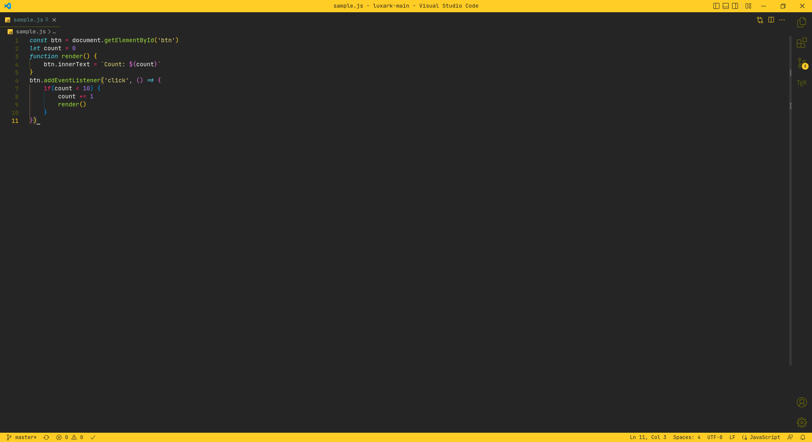

# _**Luxark theme for vscode**_

    

This is a simple vscode theme that i created inspired to <a href="https://marketplace.visualstudio.com/items?itemName=monokai.theme-monokai-pro-vscode">Monokai Pro</a>.

    

I have to say two things:
1. I based it on my specific needs, ie markdown and latex;
1. I won't maintain this theme; it's a single release. So, improve it yourself, if you want.

    

 

    <i>
        I really like it, hope you too!
    </i>

